# fullspan_income_k3 + CMDL 可视化解释

本报告基于 `RQ_res/fullspan_income_k3_cmdl/data` 中的聚合数据自动生成，所有说明均服务于 RQ 主方案的审慎表述。

## 总体读法

- 该方案包含 20 个 seed，平均 test MSE 为 `1.5581`，标准差为 `0.2183`，平均 test MAE 为 `1.2148`。
- 有效预测年份是 `2021-2023`，因为 `K=3` 的滞后结构会消耗配置测试窗口前几年的观测。
- 目标变量在同一年内基本不随区域变化，因此区域图展示的是模型响应、误差和 lag gate 差异，不应解释为区域真实目标差异。
- 机制证据偏弱：平均 `test_kstar_std=0.0413`，proxy-`k*` 调整 Spearman rho 均值 `-0.0156`，跨 seed 标准差 `0.6816`。
- CMDL 的 MSE `1.5581` 低于训练均值基线，但高于 persistence `0.1584` 和 grouped ARDL `1.4440`。

## 图逐项解释

### 数据窗口与有效预测年

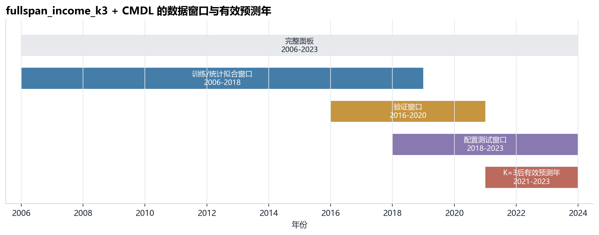

- 文件：`figures/01_data_window_timeline.png`
- 图意：展示完整面板、训练统计窗口、验证窗口、配置测试窗口，以及K=3后真正进入预测表的2021-2023年。
- 解释：这张图说明 full-span 方案如何扩大有效样本：完整面板覆盖 2006-2023，训练统计窗口到 2018，验证窗口到 2020。由于 `K=3`，真正进入预测表的是 2021-2023。
- 解释：RQ表述中应强调：本方案的主要改进首先来自更长的可用历史窗口，而不是单纯来自模型结构变化。

### 20个seed下的预测稳健性

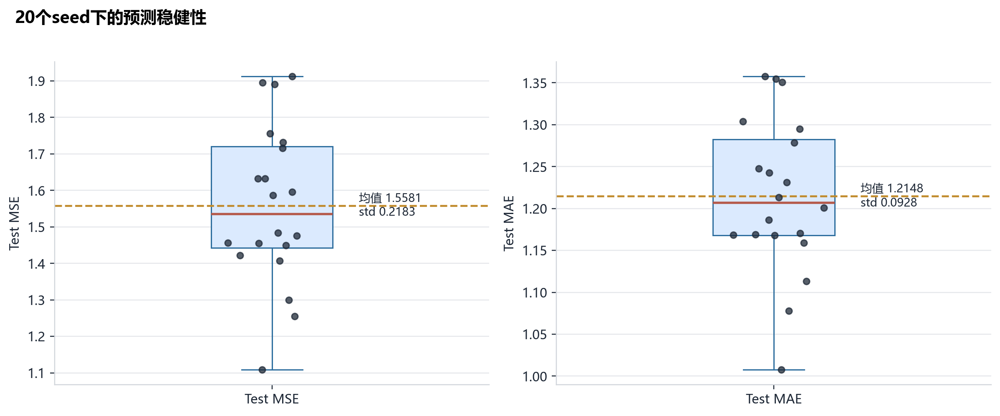

- 文件：`figures/02_seed_forecast_robustness.png`
- 图意：展示test MSE和test MAE在20个seed上的分布，避免只依赖最佳seed。
- 解释：20 个 seed 的 MSE 分布集中在 `1.1082` 到 `1.9124` 之间，均值 `1.5581`。这说明该方案比 best-seed 叙事更稳健。
- 解释：但箱线图也显示 seed 之间仍有可见差异，因此论文中应报告均值和波动，而不是只引用最低误差。

### 测试年真实值与预测轨迹

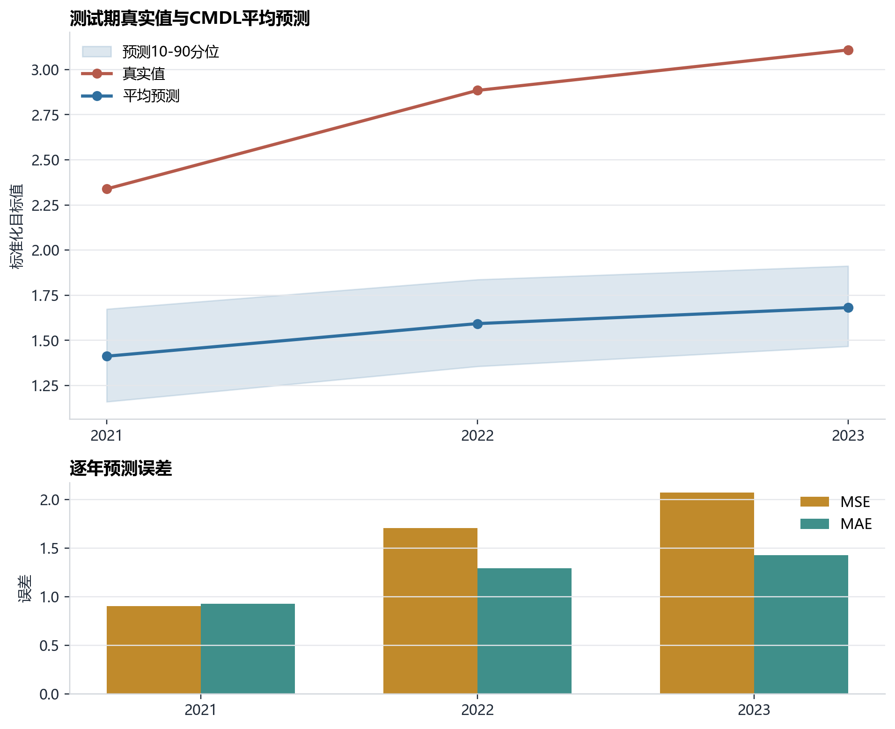

- 文件：`figures/03_test_year_forecast_trajectory.png`
- 图意：展示2021-2023年真实值、平均预测和预测分散度，并标出逐年MSE/MAE。
- 解释：真实值从 2021 到 2023 持续上升，而模型平均预测也上升但幅度不足，因此误差逐年扩大。
- 解释：这张图适合解释 CMDL 的主要预测失败模式：不是完全无趋势，而是对测试期上升幅度估计偏保守。

### CMDL与内部基线对比

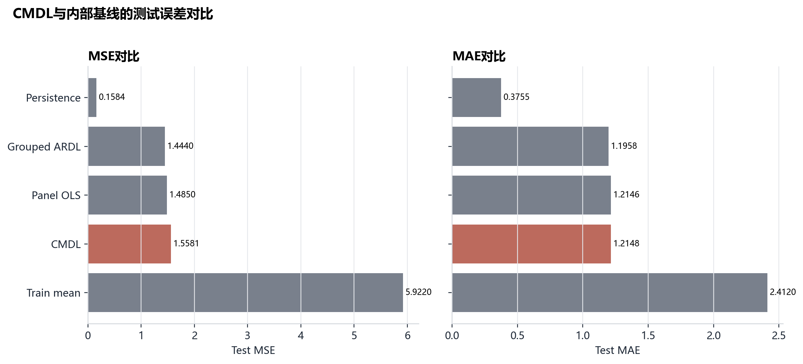

- 文件：`figures/04_baseline_comparison.png`
- 图意：比较CMDL、训练均值、persistence、Panel OLS和Grouped ARDL的测试误差。
- 解释：CMDL 明显优于 train-mean baseline，但不优于 persistence、Panel OLS 和 Grouped ARDL。
- 解释：这张图应放在 RQ 结果中约束结论：fullspan CMDL 是可报告的 AC-GATE 主设定，但不能宣称其为预测最优模型。

### 区域层面的预测误差集中度

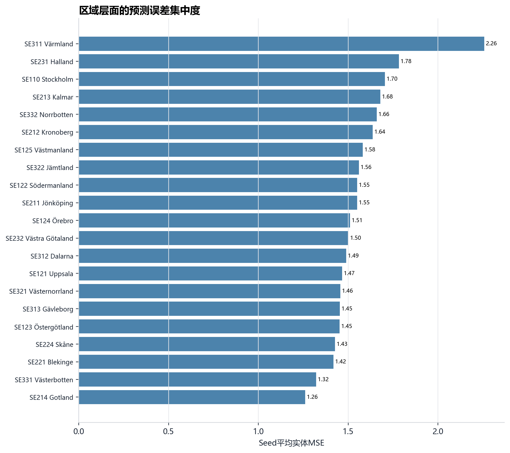

- 文件：`figures/05_region_error_concentration.png`
- 图意：按seed平均实体MSE排序，显示哪些区域的预测残差最大。
- 解释：该图显示区域层面的 seed 平均误差差异。误差最高的区域包括 Värmland, Halland, Stockholm, Kalmar, Norrbotten。
- 解释：由于真实目标对区域退化，区域误差应解释为模型对区域 proxy 的预测响应差异，而不是区域真实 outcome 的差异。

### 区域lag-gate omega组成

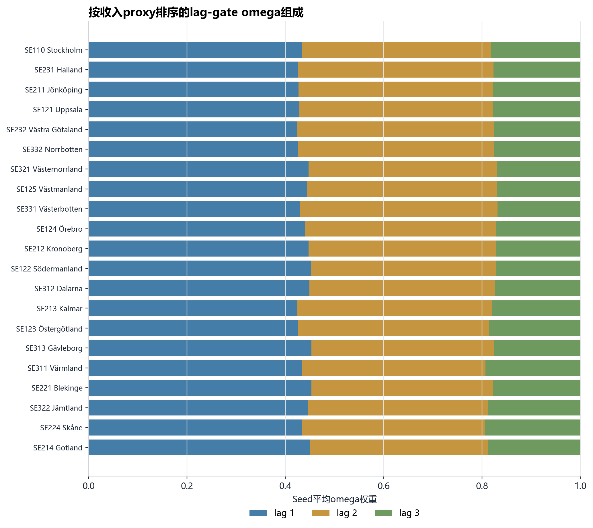

- 文件：`figures/06_omega_composition_by_region.png`
- 图意：以seed平均omega权重展示各区域lag 1/2/3的组成，避免只看单个best seed。
- 解释：该图展示每个区域在 20 个 seed 平均后的 lag 1/2/3 权重组成。整体上 lag 1 和 lag 2 占比较高，lag 3 权重较低。
- 解释：它比单一 omega heatmap 更适合当前结果，因为 seed 间 lag peak 不稳定，seed 平均能避免过度解释某一个 seed 的模式。

### 收入proxy与k*关系诊断

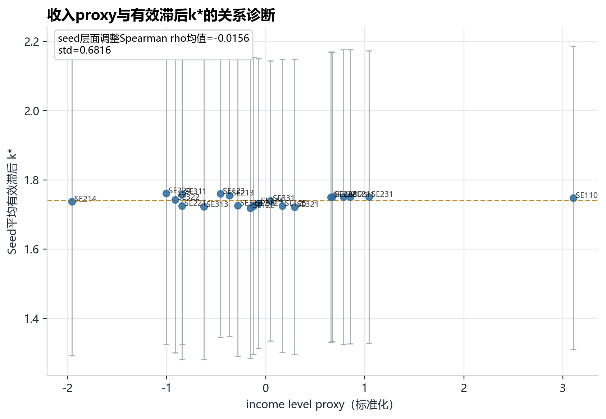

- 文件：`figures/07_proxy_vs_kstar.png`
- 图意：检验收入proxy是否稳定对应更长或更短的有效滞后。
- 解释：收入 proxy 与有效滞后 `k*` 没有稳定单调关系：seed层面的 proxy-`k*` 调整 Spearman rho 均值为 `-0.0156`，且波动很大。
- 解释：这张图是机制解释的关键限制证据：可以说 lag gate 产生了可诊断的异质性，但不宜说它稳定学习到了收入条件下的滞后机制。

### 机制指标的seed稳定性

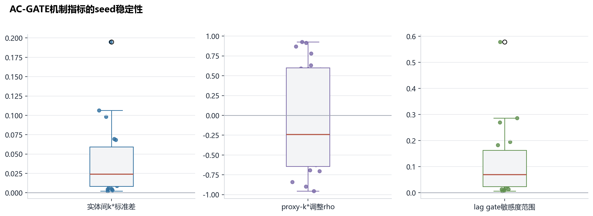

- 文件：`figures/08_mechanism_stability_across_seeds.png`
- 图意：展示k*变异、proxy-k*相关和lag-gate敏感度在20个seed上的不稳定性。
- 解释：三个机制指标都显示 seed 敏感性：`k*` 的实体间变异偏低，proxy-`k*` 相关在正负之间摆动，lag-gate sensitivity 也不稳定。
- 解释：这支持把 AC-GATE 机制结果写成 exploratory diagnostic，而不是 confirmatory mechanism evidence。

### 跨seed训练动态

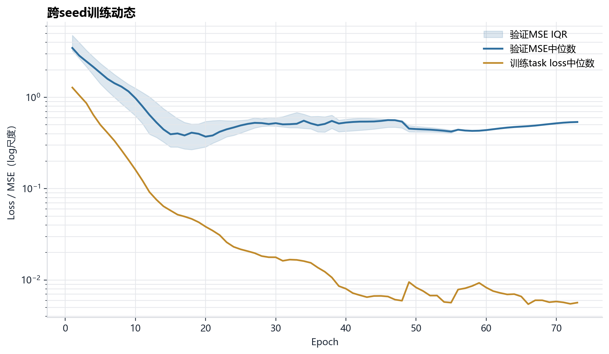

- 文件：`figures/09_training_dynamics.png`
- 图意：展示训练task loss与验证MSE的中位数和验证MSE四分位范围。
- 解释：训练 task loss 通常下降，而验证 MSE 在 early stopping 前后出现明显变化。log尺度使早期大误差和后期收敛同时可见。
- 解释：该图适合作为补充材料，说明训练过程并非完全失控，但泛化误差仍受测试期目标上升影响。

### proxy重构诊断

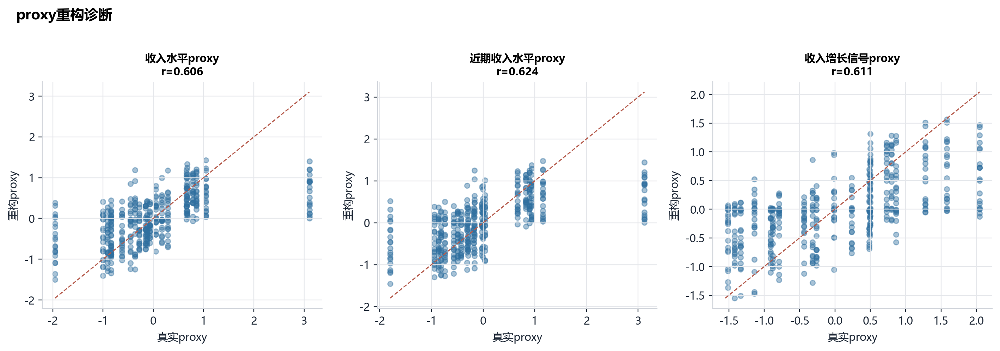

- 文件：`figures/10_proxy_reconstruction_diagnostic.png`
- 图意：检查AC编码器/重构头对三个income proxy的重构质量。
- 解释：三个 proxy 的重构散点显示 AC encoder/reconstruction 只部分恢复 proxy 空间，尤其增长信号通常更难重构。
- 解释：这解释了为什么 proxy-conditioned lag 机制较弱：如果 proxy 表征本身不够稳定，后续 lag gate 很难形成强关系。

### RQ主结果四联图

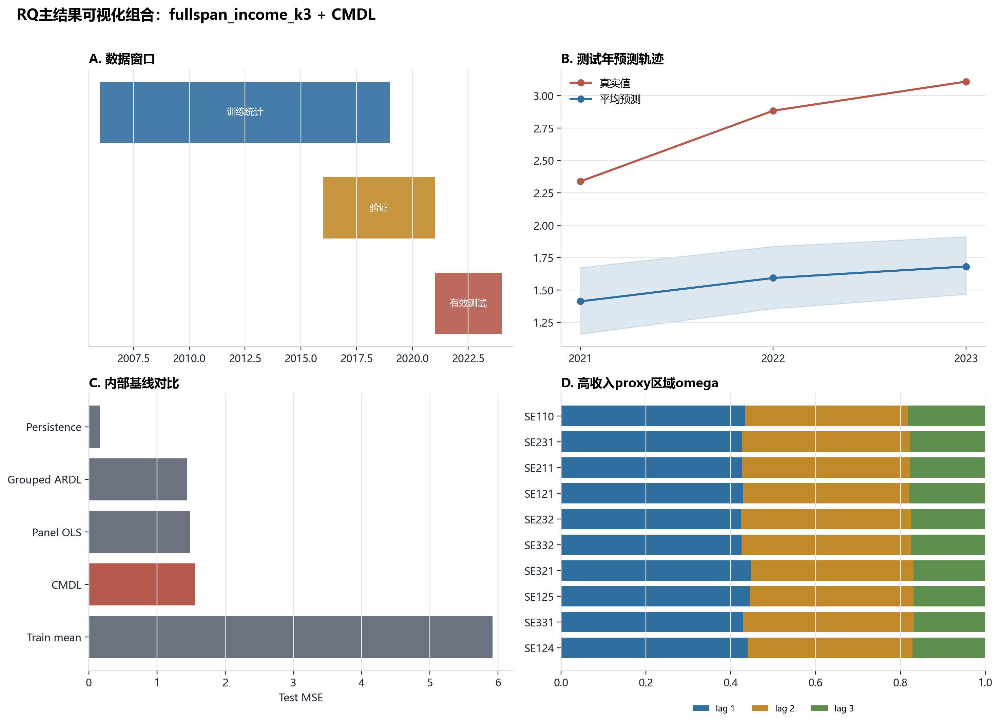

- 文件：`figures/11_rq_main_figure_bundle.png`
- 图意：将数据窗口、预测轨迹、内部基线和omega诊断合并为适合论文RQ段落的四联图。
- 解释：四联图把 RQ 主叙事压缩到一张图：样本窗口、测试期预测、内部基线对比、lag-gate 诊断。
- 解释：建议作为主文候选图，但 caption 要明确：该图支持 full-span RQ 方案的可报告性，不支持 AC-GATE 预测最优或强机制结论。

## 建议用于论文/RQ的表述

可以写：full-span income/RPCYD CMDL 设定显著改善了 RQ 实验的样本覆盖和运行稳定性；在 20 个 seed 上，预测误差分布较稳定，并能产生可诊断的 lag-gate 权重。

需要避免写：AC-GATE 明确优于所有基线，或收入 proxy 稳定决定了有效滞后。当前可视化显示 persistence 与 grouped ARDL 更强，且 proxy-`k*` 机制关系不稳定。
